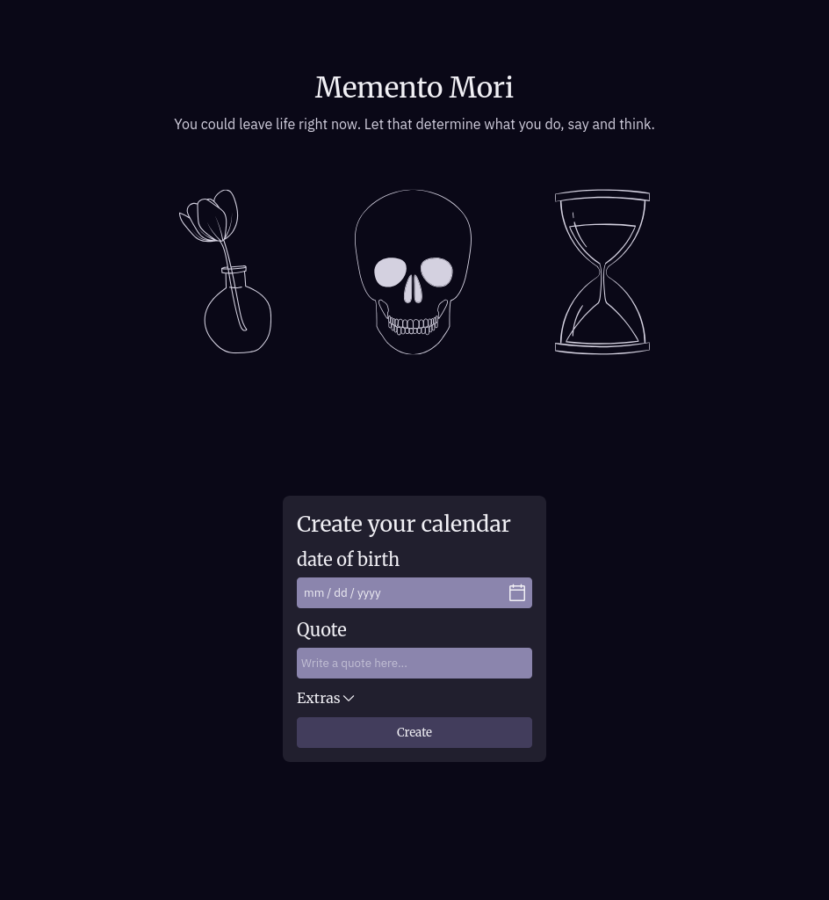

# Memento

Memento is a memento mori calendar generator. You enter your birth date, an inspiring quote with its author, choose some colors (optional), and voilà — you get a calendar with the number of weeks you’ve lived so far filled in. Quite convenient, isn’t it?

The idea for this project occurred to me when I remembered how much I disliked filling in the last calendar I printed. I'm sure there are other people out there who hate it too, so I made a page for it.

(It’s quite funny now that I think about it. I was too lazy to fill in a calendar by hand, which would have taken like 10 minutes, so I spent two months designing and developing a website.)

**Link to project:** [https://enzodev10.github.io/Memento/](https://enzodev10.github.io/Memento/)

## How It's Made

**Tech used:** Typescript, React, styled-components, react-pdf, figma

All of this started in Figma with this [design](https://www.figma.com/design/DTLKa1KIkn9JuVfVb2n5fI/memento-Mori-Skulls?m=auto&t=6GLtZ7gnpx0YwlKX-6).

This is actually a redesign, the original one had colors that went better with more upbeat themes so It was changed to a palette that better fits the overall theme of the website: the passing of time and the inevitability of death.

The three images right below the heading are a reference to this [painting](<https://en.wikipedia.org/wiki/Vanitas_(Champaigne)>) made by [Philippe de Champaigne](https://en.wikipedia.org/wiki/Philippe_de_Champaigne).

## Future Improvements

- Add more languages, such as Spanish and Portuguese.
- Allow users to choose between downloading an image or a PDF file.
- Change the current color picker for a non native one.
- Have more than one layout for the calendar, something like a horizontal one.

## Lessons Learned

The thing I appreciate most about this project is how much I learned about organizing files. Isn previous projects there was a point in which i would get lost time and time again because the organization was a mess, there were important components inside one another, components that were reused in many places were not placed in a common folder and the imports had an astounding length. That changed with this project because I applied some principles from [bulletproof-react](https://github.com/alan2207/bulletproof-react) lessons I will continue to use in future projects.

## Where to find me

Do you want to collaborate or talk about one of my projects? you can find me in one of these places:

[**Linkedin**](https://www.linkedin.com/in/enzo-ca%C3%B1ete/)
